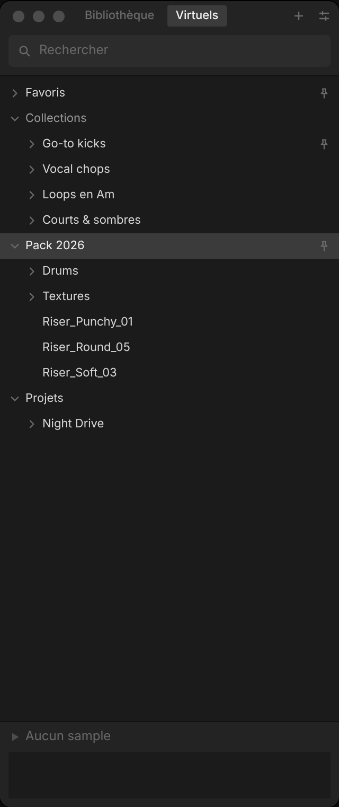
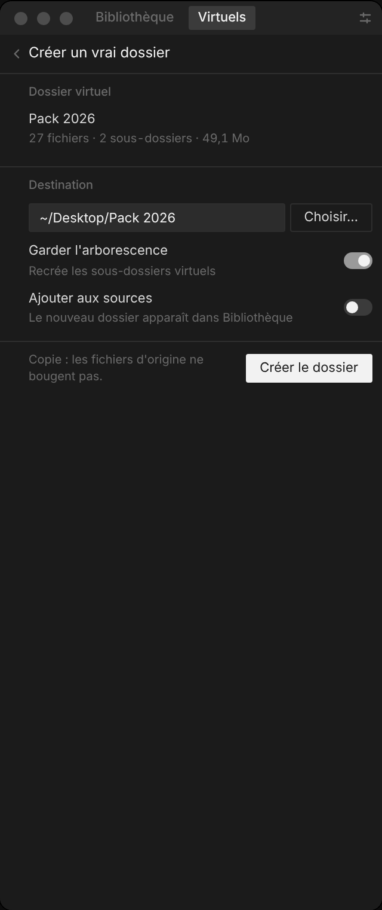

# Crate — navigateur de samples (phase 6 : bibliothèque réelle, son, glisser, analyse de fond)

Navigateur de samples pour Mac, pensé pour une colonne étroite à côté du DAW (comme le browser d'Ableton) :
une arborescence de dossiers qui s'ouvre sur les samples, un second onglet pour les favoris, collections et dossiers
virtuels (qu'on peut transformer en vrai dossier), et en bas le sample courant avec sa waveform.
La fenêtre indexe de **vrais dossiers** (SQLite, scan incrémental, surveillance des changements), les **joue**
(son réel, waveform réelle, clic dans la waveform pour lire depuis un point) et les **glisse vers le DAW** ou le Finder. Le prototype en ligne et Storybook restent sur des données factices.

**Plan et prompts à jour :** [`docs/plan.md`](docs/plan.md) · **À vérifier sur Mac :** [`docs/verification-mac.md`](docs/verification-mac.md) · **Validation phase 0 :** [`docs/phase0-checklist.md`](docs/phase0-checklist.md)

**En ligne :** [design system (Storybook)](https://plptune.github.io/sample-browser/storybook/) ·
[prototype](https://plptune.github.io/sample-browser/) — redéployé par `.github/workflows/pages.yml` à chaque push.

```bash
pnpm install
pnpm dev          # http://localhost:1420
pnpm build        # typecheck + build
pnpm test:e2e     # tests navigateur du prototype (Playwright, lance le serveur si besoin)
```

- `http://localhost:1420/` : le panneau + une barre de démo (scénario, thème, largeur, densité, grille 4 px).
- `pnpm storybook` → `http://localhost:6006` : le design system dans Storybook — fondations (principes, tokens),
  chaque composant dans chacun de ses états avec contrôles, et le panneau complet par scénario.
  Barre d'outils : thème sombre / clair et largeur du panneau (260 → 520 px).

## Clavier

| Touche | Action |
| --- | --- |
| ⌘F ou `/` | Recherche ; dans Live ou Bitwig, ⌘F amène Crate devant, sur la recherche (Échap y revient) |
| ↑ ↓ (⇧ pour étendre) | Naviguer dans l'arbre (avec la lecture auto, active par défaut, le sample joue aussitôt) |
| → | Ouvrir un dossier, y entrer s'il est ouvert, lire un sample |
| ← | Fermer un dossier, sinon remonter au dossier parent |
| ⌘← | Tout replier (le curseur remonte au premier niveau) |
| Espace | Lecture / stop du sample courant |
| ⇧← / ⇧→ | Reculer / avancer d'un dixième dans le sample |
| ⏎ | Ouvrir / fermer un dossier, lire un sample, suivre un raccourci |
| ⌥← / ⌥→, ⌘[ / ⌘] | Historique : saut précédent / suivant (aussi les boutons de la souris) |
| T | Taguer la sélection (popover) |
| ⌘D | Favori / pas favori (sélection) |
| ⌘S | Enregistrer la recherche comme collection smart |
| ⌘1 / ⌘2 | Onglet Bibliothèque / Virtuels |
| ⌘N | Nouveau dossier virtuel |
| ⌘⇧N | Nouvelle collection |
| ⌘⌫ | Retirer de la collection / du dossier virtuel ouvert ; dans la Bibliothèque, masquer |
| ⇧F10 (ou touche Menu) | Menu contextuel de la ligne courante |
| ⌘O | Ajouter un dossier (fenêtre) |
| ⌥⌘R | Afficher le sample (ou ouvrir le dossier) dans le Finder ; aussi au clic droit |
| ⌥⌘D | Mesures en direct : calcul de l'arbre, échange, rendu (budget 16 ms par frappe), latence du son |
| ⌘L | Boucle |
| ⌘⇧Espace | Lire un sample au hasard parmi les lignes de l'arbre |
| ⌘, | Réglages (Échap pour revenir) |
| ⌘⇧F | Grande fenêtre (arbre large + inspecteur) / retour en colonne ; aussi le bouton ⤢ |
| Échap | Fermer la surcouche ouverte, sinon stop |
| `#`, `key:`, `in:` | Autocomplétion ; ⏎ ou Tab pour choisir |
| ⌫ en début de champ | Supprimer la dernière chip |
| 1–9, 0, -, =, [, ] | Scénarios de démo 1 à 14 |

Souris : clic sur le chevron = ouvrir / fermer ; clic, ⇧-clic, ⌘-clic = sélection ; double-clic = ouvrir un dossier
ou lire un sample ; glisser des samples sur une collection manuelle les y ajoute ; clic droit = menu contextuel
(lire, taguer, ajouter à une collection, masquer / afficher, renommer / supprimer une collection, déplacer un dossier
virtuel, retirer une source). Tout ce que fait la souris se fait aussi au clavier, sauf glisser vers le DAW.

## Scénarios livrés

Les 12 scénarios du plan : 1 Premier lancement · 2 Indexation · 3 Navigation · 4 Recherche active · 5 Aucun résultat ·
6 Lecture · 7 Tagging · 8 Collections (⌘S) · 9 Drag en cours · 10 Erreurs · 11 Réglages · 12 Mode waveform ·
13 Dossiers virtuels (`[`) · 14 Créer un vrai dossier (`]`).
Validation : [`docs/phase0-checklist.md`](docs/phase0-checklist.md).

## Fenêtre Tauri et cœur Rust

```bash
pnpm tauri dev                 # fenêtre 320 × 760 sur votre vraie bibliothèque
CRATE_DEMO=1 pnpm tauri dev    # même fenêtre sur les données du prototype (touches de scénario actives)
CRATE_TRACE=1 pnpm tauri dev   # + trace des commandes et des scans sur stderr
pnpm tauri build               # Crate.app (macOS)
cargo test --workspace         # tests Rust (parité, scan réel, persistance…), régénère src/api/bindings.ts
cargo test --release -p crate-core --test bench_scan -- --ignored --nocapture   # mesures sur 100 000 fichiers
cargo test --release -p crate-core --test analysis -- --nocapture             # précision de l'analyse (jeu test annoté)
CRATE_ANALYSIS_DIR=~/Music/Samples cargo test --release -p crate-core --test analysis -- --ignored --nocapture  # audio vs noms d'un vrai dossier
pnpm parity:fixture            # régénère l'empreinte du mock TypeScript après une modification du mock
```

Premier lancement : glissez un dossier sur la fenêtre (ou ⌘O, ou Réglages › Ajouter un dossier…). Crate le parcourt
(wav, aif, flac, mp3, ogg), lit les en-têtes et range tout dans `crate.db`, dans le dossier de données de l'app
(`~/Library/Application Support/com.plptune.crate/`). Rien n'est jamais écrit dans vos dossiers, sauf par
« Créer un vrai dossier », qui copie dans un nouveau dossier. Les sources sont surveillées : un fichier ajouté,
modifié ou supprimé apparaît tout seul ; « Actualiser » (clic droit sur une source) force un rescan.
Un fichier disparu reste visible, barré, s'il est dans un favori, un tag, une collection ou un dossier virtuel.
Lecture : Espace, ⏎ ou → ; clic dans la waveform du tiroir pour lire depuis ce point ; boucle, volume et arrêt
automatique (au glisser, en arrière-plan) dans les Réglages. Glisser un sample (ou la sélection) hors de la fenêtre :
le fichier part vers Ableton, Logic ou le Finder.
Fichiers MIDI (`.mid`) : indexés comme des samples (repère « MIDI », `type:midi`), joués par un piano synthétique,
glissés tels quels vers le DAW.
Tempo, tonalité et boucle / one-shot : pris dans le nom dès le scan (`Bass_Loop_115_Bm`), puis analysés dans l'audio
en fond (deux threads, repris au lancement suivant ; avancement dans Réglages › Sources). `key:A#` trouve aussi `Bb`.
Masquer (⌘⌫ ou clic droit) retire un sample ou un sous-dossier de partout sans toucher au disque ; `is:hidden` les
retrouve, « Afficher » annule. Les réglages (thème, densité, lecture, fenêtre) sont gardés d'un lancement à l'autre.
Recherche : un mot d'un groupe de synonymes trouve aussi les autres (`kick` trouve `bd`) ; les groupes se modifient
dans Réglages › Synonymes. Prototype : `?overscan=1000` dans l'URL monte toutes les lignes (utile aux tests).
Chaque push construit aussi un `Crate.app` sur macOS (workflow « Tauri (macOS) », artefact `Crate-macos`,
non signé : clic droit → Ouvrir au premier lancement).

## Structure

```
src/
  api/          contrat Backend (types.ts), mock.ts, tauri.ts, bindings.ts (généré), contract.ts (vérif.)
  mock/         ~400 samples déterministes (graine fixe), tags, collections, arborescence
  lib/query.ts  découpage de la ligne de recherche en tokens / chips
  state/app.ts  état d'UI (signaux Solid)
  components/   un fichier par composant du design system
  styles/       tokens.css + bundle.css (design system)
  demo/         barre de démo et scénarios (hors design system)
crates/crate-core/  cœur Rust sans Tauri : modèle, recherche, catalogue (arbre en mémoire), base SQLite, scan,
                    indexeur (thread + notify), bibliothèque réelle et factice, trait Backend
src-tauri/      fenêtre Tauri 2 : une commande typée par méthode du contrat
scripts/        empreinte de parité TS → Rust
  stories/      fondations Storybook (introduction, tokens) ; les stories des composants sont à côté de chaque composant
.storybook/     configuration Storybook (framework storybook-solidjs-vite)
docs/design-system.md
```

## Architecture

```
UI SolidJS ─► src/api/index.ts (Backend) ─┬─ mock.ts   navigateur, Storybook, Pages
                                          └─ tauri.ts  fenêtre ─► src-tauri (commandes) ─► crates/crate-core
                                                                                    ├─ SqliteLibrary  catalogue ⇄ crate.db
                                                                                    └─ Indexer        scans, notify ─► événement scan-event
```

Les composants, le CSS et l'état ne dépendent que du contrat `src/api/types.ts`. La suite (index SQLite, recherche,
audio…) est décrite dans [`docs/plan.md`](docs/plan.md).

## Captures

| Navigation | Recherche | Lecture | Tagging | ⌘S | Drag |
| --- | --- | --- | --- | --- | --- |
|  |  |  |  |  |  |

| Erreurs | Réglages | Waveform | Dossiers virtuels | Créer un vrai dossier | Fenêtre Tauri, données Rust (Linux) |
| --- | --- | --- | --- | --- | --- |
|  |  |  |  |  |  |
