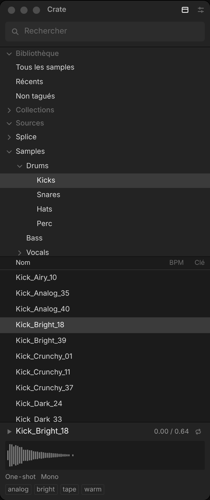
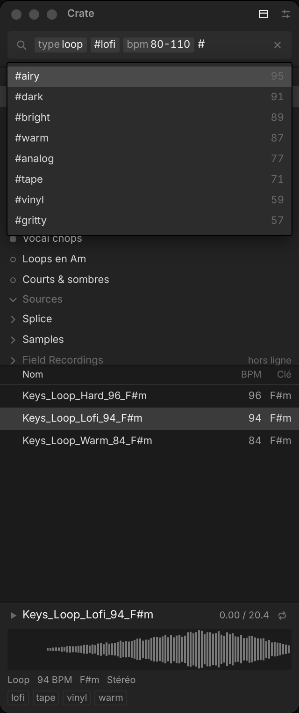
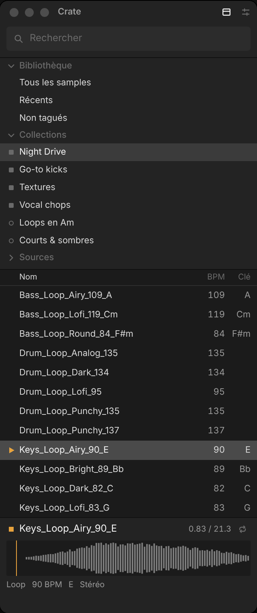
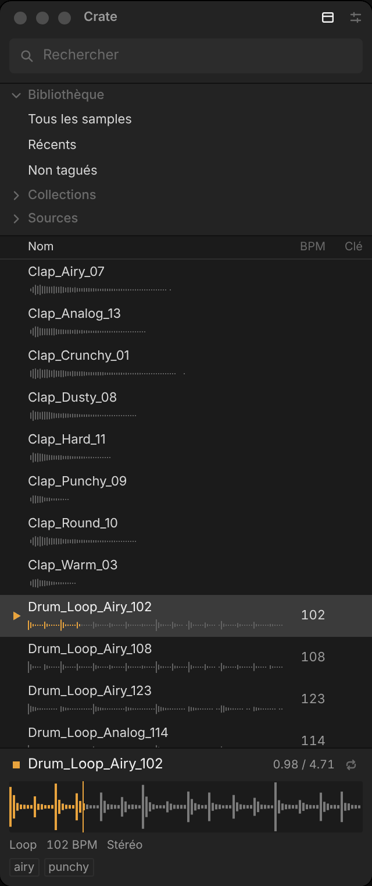
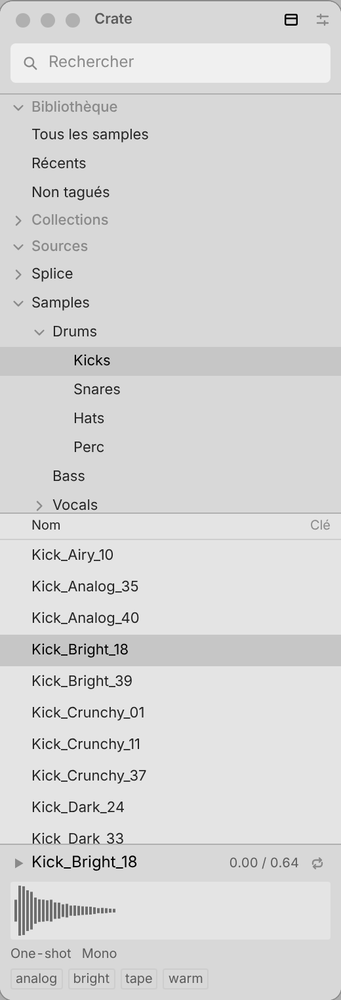
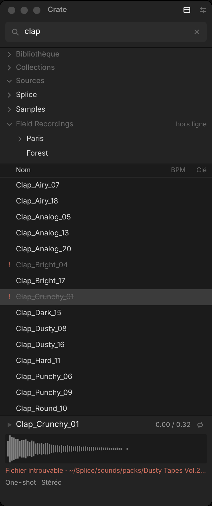

# Crate — prototype d'interface (phase 0)

Navigateur de samples pour Mac, pensé pour une colonne étroite à côté du DAW (comme le browser d'Ableton).
Ce dépôt ne contient pour l'instant **que l'interface, entièrement factice** : aucun son, aucun fichier lu, aucune base.

```bash
pnpm install
pnpm dev          # http://localhost:1420
pnpm build        # typecheck + build
```

- `http://localhost:1420/` : le panneau + une barre de démo (scénario, thème, largeur, densité, grille 4 px).
- `http://localhost:1420/#/gallery` : tous les composants dans tous leurs états, sombre / clair, 260 / 380 px.

## Clavier

| Touche | Action |
| --- | --- |
| ⌘F ou `/` | Recherche |
| ↑ ↓ (⇧ pour étendre) | Naviguer dans la liste |
| Espace / → / ← | Lecture-stop / lire / stop (fausse lecture) |
| `#`, `key:`, `in:` | Autocomplétion ; ⏎ ou Tab pour choisir |
| ⌫ en début de champ | Supprimer la dernière chip |
| 1–6, 0, = | Scénarios de démo |

Souris : clic, ⇧-clic, ⌘-clic, double-clic = lecture, glisser une ligne sur une collection manuelle (état visuel),
double-clic sur une collection = renommer.

## Scénarios livrés

1 Premier lancement · 2 Indexation en cours · 3 Navigation · 4 Recherche active · 5 Aucun résultat ·
6 Lecture · 10 Erreurs · 12 Mode waveform.
Pas encore faits : 7 Tagging (popover), 8 Collections / création smart (⌘S), 9 Drag (scénario figé),
11 Réglages, menu contextuel.

## Structure

```
src/
  api/          contrat Backend (types.ts) + implémentation factice (mock.ts)
  mock/         ~400 samples déterministes (graine fixe), tags, collections, arborescence
  lib/query.ts  découpage de la ligne de recherche en tokens / chips
  state/app.ts  état d'UI (signaux Solid)
  components/   un fichier par composant du design system
  styles/       tokens.css + bundle.css (design system)
  demo/         barre de démo, scénarios, galerie (hors design system)
docs/design-system.md
```

## Passage à Tauri / Rust (phase 1)

L'UI ne parle au « backend » qu'à travers `src/api/index.ts` (interface `Backend`, toutes les méthodes sont `async`).
Pour brancher Rust :

1. `pnpm tauri init` (devUrl `http://localhost:1420`, frontendDist `../dist`) — le port Vite est déjà fixé.
2. Écrire les commandes Rust avec les mêmes signatures que `Backend` ; générer les types TS avec tauri-specta.
3. Créer `src/api/tauri.ts` (appels `invoke`) et changer une ligne dans `src/api/index.ts`.

Les composants, le CSS et le state ne bougent pas.

## Captures

| Navigation | Recherche | Lecture | Waveform | Clair 260 px | Erreurs |
| --- | --- | --- | --- | --- | --- |
|  |  |  |  |  |  |
