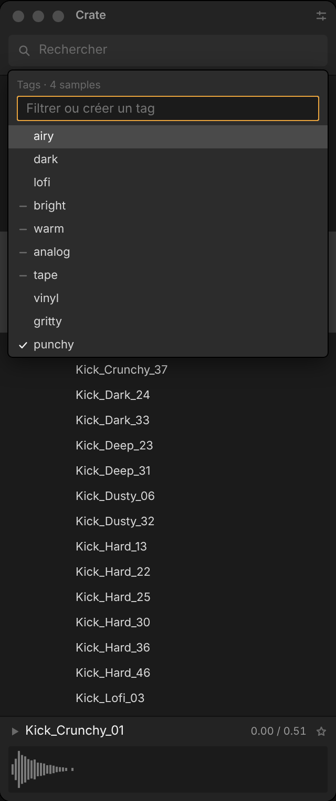
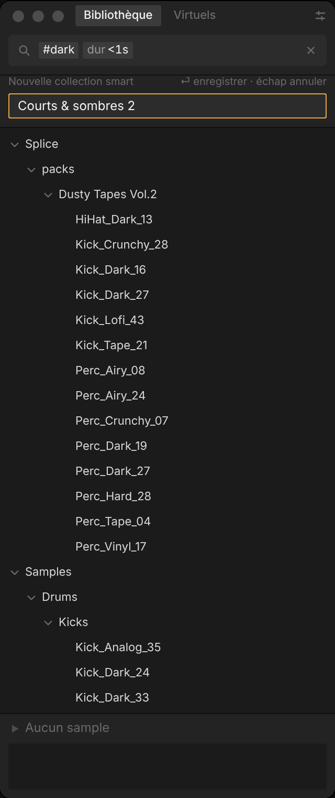
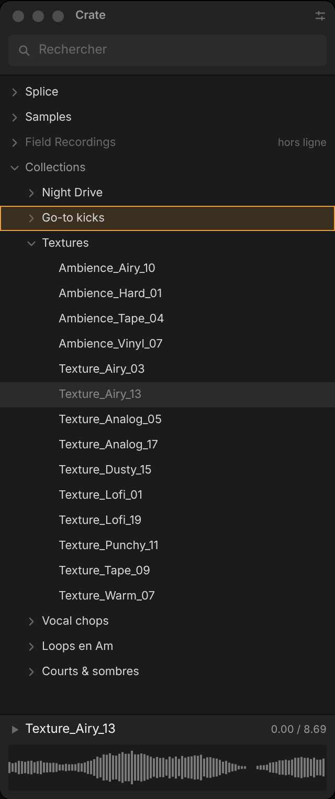
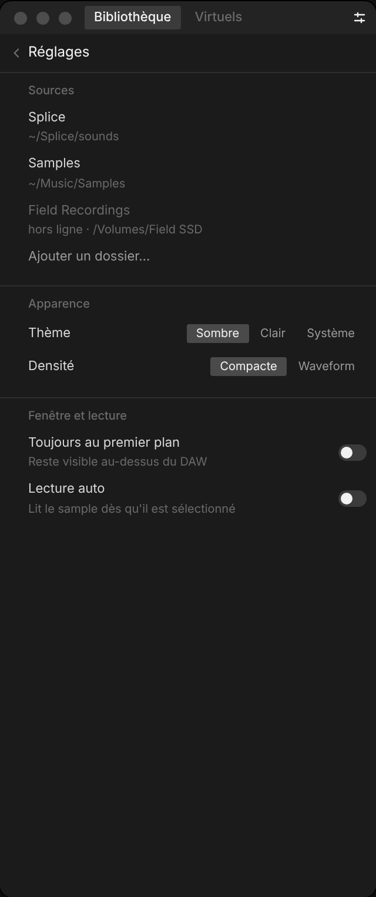
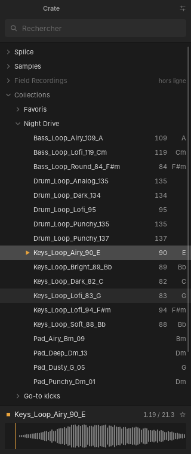

# Crate — prototype d'interface (phase 0)

Navigateur de samples pour Mac, pensé pour une colonne étroite à côté du DAW (comme le browser d'Ableton) :
une seule arborescence de dossiers qui s'ouvre sur les samples, et en bas le sample courant avec sa waveform.
Ce dépôt ne contient pour l'instant **que l'interface, entièrement factice** : aucun son, aucun fichier lu, aucune base.

**Plan et prompts à jour :** [`docs/plan.md`](docs/plan.md) · **Validation phase 0 :** [`docs/phase0-checklist.md`](docs/phase0-checklist.md)

**En ligne :** [design system (Storybook)](https://plptune.github.io/sample-browser/storybook/) ·
[prototype](https://plptune.github.io/sample-browser/) — redéployé par `.github/workflows/pages.yml` à chaque push.

```bash
pnpm install
pnpm dev          # http://localhost:1420
pnpm build        # typecheck + build
```

- `http://localhost:1420/` : le panneau + une barre de démo (scénario, thème, largeur, densité, grille 4 px).
- `pnpm storybook` → `http://localhost:6006` : le design system dans Storybook — fondations (principes, tokens),
  chaque composant dans chacun de ses états avec contrôles, et le panneau complet par scénario.
  Barre d'outils : thème sombre / clair et largeur du panneau (260 → 520 px).

## Clavier

| Touche | Action |
| --- | --- |
| ⌘F ou `/` | Recherche |
| ↑ ↓ (⇧ pour étendre) | Naviguer dans l'arbre |
| → | Ouvrir un dossier, y entrer s'il est ouvert, lire un sample |
| ← | Fermer un dossier, sinon remonter au dossier parent |
| Espace | Lecture / stop du sample courant (fausse lecture) |
| ⏎ | Ouvrir / fermer un dossier, lire un sample |
| T | Taguer la sélection (popover) |
| ⌘D | Favori / pas favori (sélection) |
| ⌘S | Enregistrer la recherche comme collection smart |
| ⌘, | Réglages (Échap pour revenir) |
| Échap | Fermer la surcouche ouverte, sinon stop |
| `#`, `key:`, `in:` | Autocomplétion ; ⏎ ou Tab pour choisir |
| ⌫ en début de champ | Supprimer la dernière chip |
| 1–9, 0, -, = | Scénarios de démo 1 à 12 |

Souris : clic sur le chevron = ouvrir / fermer ; clic, ⇧-clic, ⌘-clic = sélection ; double-clic = ouvrir un dossier
ou lire un sample ; glisser des samples sur une collection manuelle les y ajoute ; clic droit = menu contextuel
(lire, taguer, ajouter à une collection, renommer / supprimer une collection, retirer une source).

## Scénarios livrés

Les 12 scénarios du plan : 1 Premier lancement · 2 Indexation · 3 Navigation · 4 Recherche active · 5 Aucun résultat ·
6 Lecture · 7 Tagging · 8 Collections (⌘S) · 9 Drag en cours · 10 Erreurs · 11 Réglages · 12 Mode waveform.
Validation : [`docs/phase0-checklist.md`](docs/phase0-checklist.md).

## Fenêtre Tauri et cœur Rust

```bash
pnpm tauri dev                 # fenêtre 320 × 760 ; les données viennent de Rust (crates/crate-core)
CRATE_TRACE=1 pnpm tauri dev   # + trace des commandes sur stderr
pnpm tauri build               # Crate.app (macOS)
cargo test --workspace         # tests Rust, parité avec le prototype, régénère src/api/bindings.ts
pnpm parity:fixture            # régénère l'empreinte du mock TypeScript après une modification du mock
```

Phase 1 : le cœur Rust sert encore les données factices du prototype (mêmes samples, mêmes arbres, vérifié par test).
Dans le navigateur et Storybook, l'UI utilise le mock TypeScript ; dans la fenêtre, les commandes Rust.
Chaque push construit aussi un `Crate.app` sur macOS (workflow « Tauri (macOS) », artefact `Crate-macos`,
non signé : clic droit → Ouvrir au premier lancement).

## Structure

```
src/
  api/          contrat Backend (types.ts), mock.ts, tauri.ts, bindings.ts (généré), contract.ts (vérif.)
  mock/         ~400 samples déterministes (graine fixe), tags, collections, arborescence
  lib/query.ts  découpage de la ligne de recherche en tokens / chips
  state/app.ts  état d'UI (signaux Solid)
  components/   un fichier par composant du design system
  styles/       tokens.css + bundle.css (design system)
  demo/         barre de démo et scénarios (hors design system)
crates/crate-core/  cœur Rust sans Tauri : modèle, recherche, tri, bibliothèque factice, trait Backend
src-tauri/      fenêtre Tauri 2 : une commande typée par méthode du contrat
scripts/        empreinte de parité TS → Rust
  stories/      fondations Storybook (introduction, tokens) ; les stories des composants sont à côté de chaque composant
.storybook/     configuration Storybook (framework storybook-solidjs-vite)
docs/design-system.md
```

## Architecture

```
UI SolidJS ─► src/api/index.ts (Backend) ─┬─ mock.ts   navigateur, Storybook, Pages
                                          └─ tauri.ts  fenêtre ─► src-tauri (commandes) ─► crates/crate-core
```

Les composants, le CSS et l'état ne dépendent que du contrat `src/api/types.ts`. La suite (index SQLite, recherche,
audio…) est décrite dans [`docs/plan.md`](docs/plan.md).

## Captures

| Navigation | Recherche | Lecture | Tagging | ⌘S | Drag |
| --- | --- | --- | --- | --- | --- |
|  |  |  |  |  |  |

| Erreurs | Réglages | Waveform | Clair 260 px | Fenêtre Tauri, données Rust (Linux) |
| --- | --- | --- | --- | --- |
|  |  |  |  |  |
